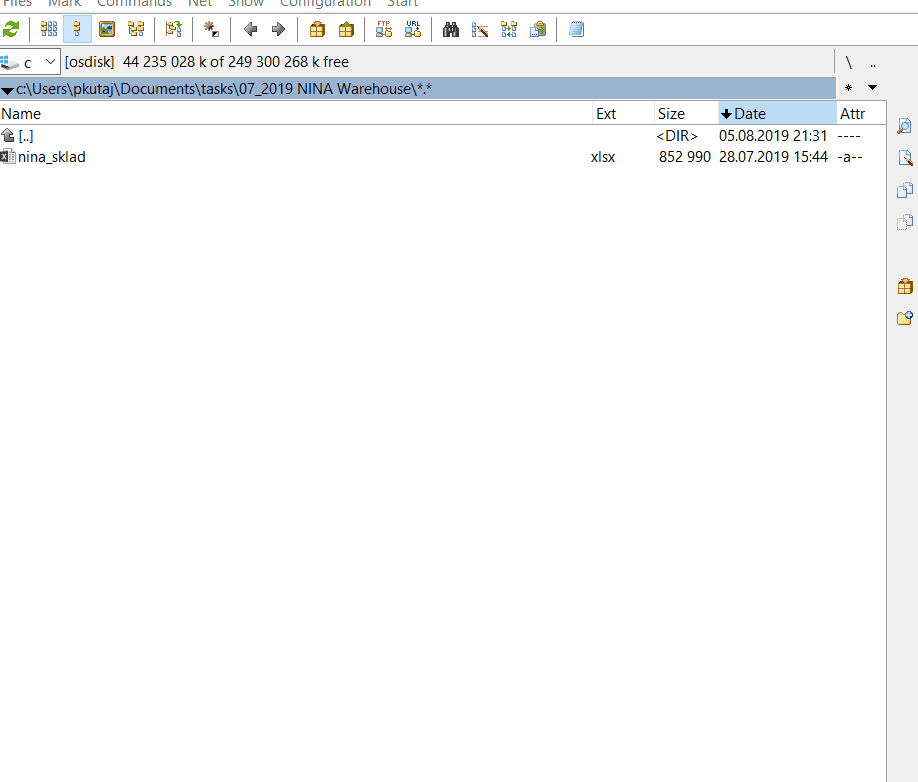

## PURPOSE 
   The aim of this script is to create a mutation of total commander's multi-rename tool, but it should create X copies of an existing template file with incremental numbering

## TOC
 
STEP | ACTION
-----|------------------------------------------------------------------------
0.1  | Create an intro +outro here-string with an ascii art proper
1    | Create function with mandatory parameters: file Name + number of copies
2    | Get a template file
3    | For-Loop
3.1  | Create new file name / file path
3.2  | Create a copy of template files

## INSPIRATION
 https://stackoverflow.com/questions/49573376/take-a-file-and-copy-and-rename-multiple-times-over-certain-folders

## CREATED
 2019-08-01 14:03:33, brno
 